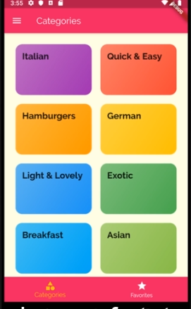
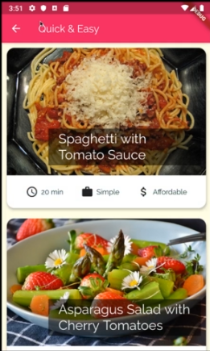
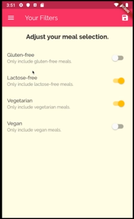

# Meals App
this mobile app with cross-platform (Flutter) shows the recipes for a meal in different categories and many options to filter the meals.

## Screenshots

<table>
  <tr>
    <td>Home</td>
     <td>Meals</td>
     <td>Filters</td>
  </tr>
  <tr>
    <td></td>
    <td></td>
    <td></td>
  </tr>
 </table>

